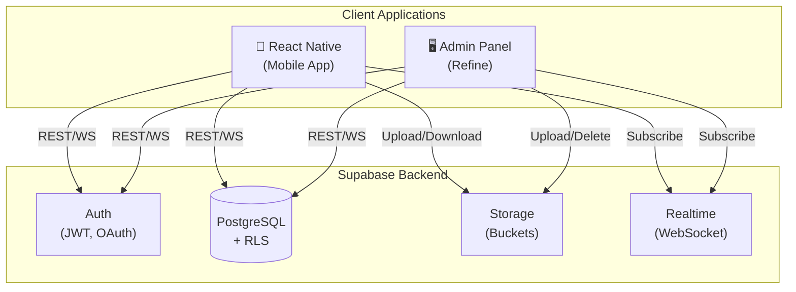
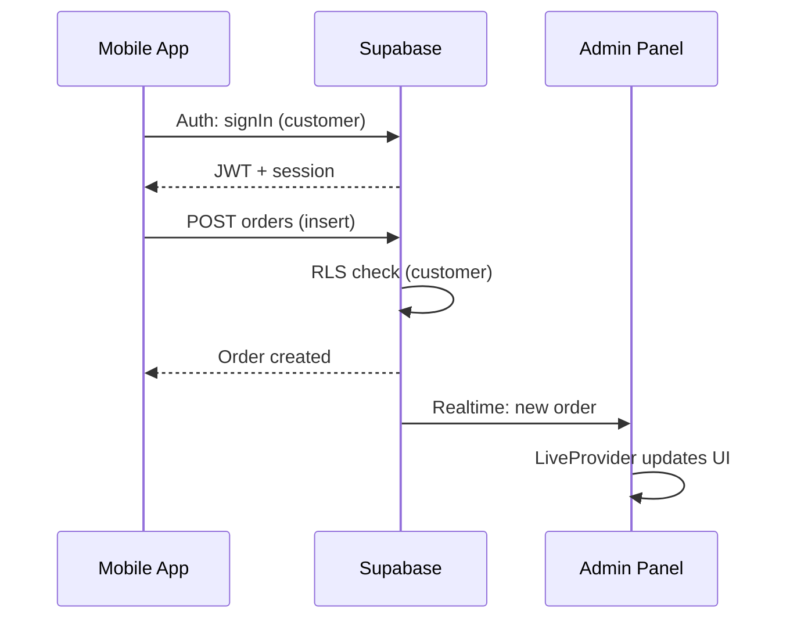
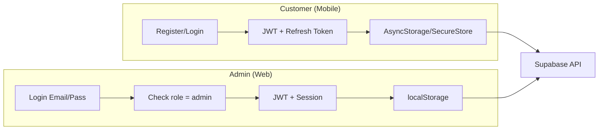
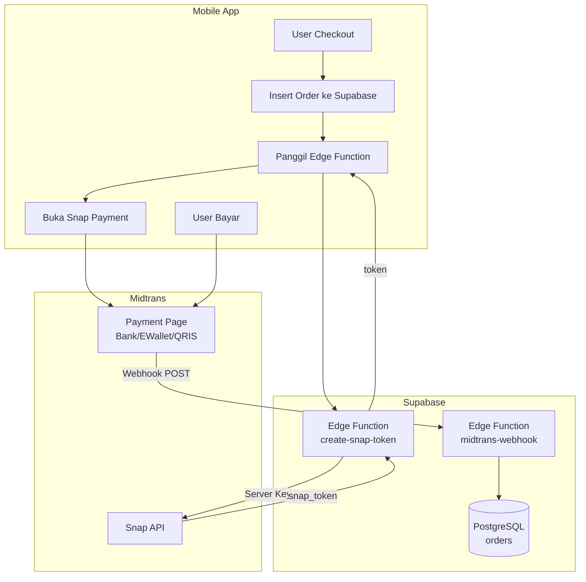
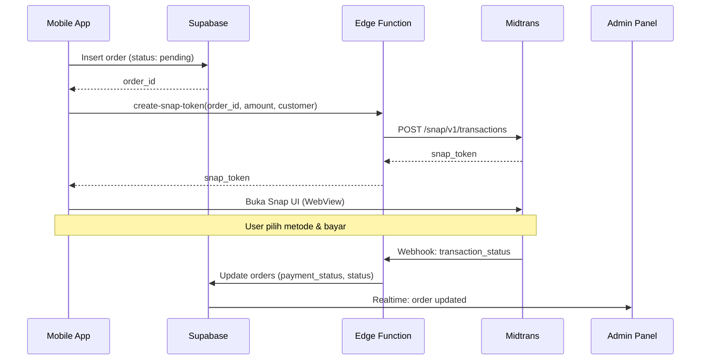
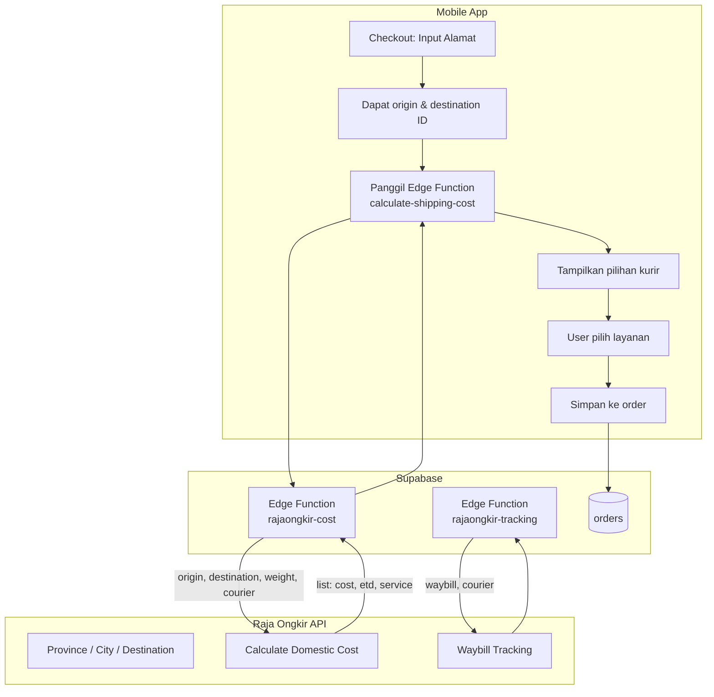
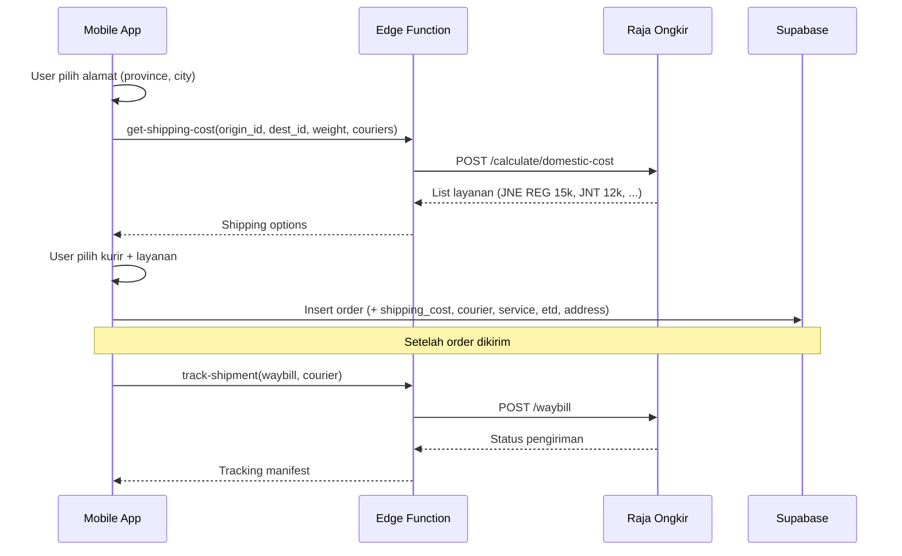
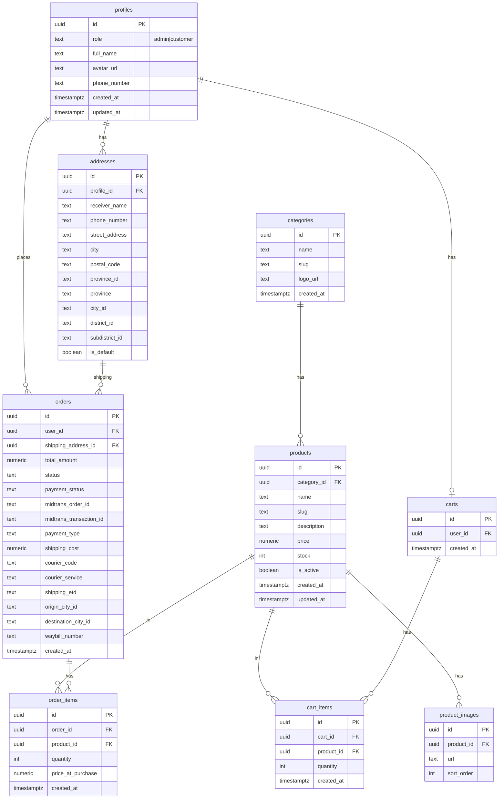

# System Architecture — Apotek E-commerce

> Dokumen arsitektur sistem untuk project Apotek E-commerce yang terdiri dari Frontend React Native (mobile), Admin Panel Refine, dan Backend/Database Supabase.

---

## 1. Gambaran Umum

Sistem Apotek E-commerce adalah solusi lengkap untuk menjual produk apotek secara daring. Terdiri dari tiga komponen utama yang berbagi satu backend Supabase:

| Komponen | Teknologi | Peran |
|----------|-----------|-------|
| **Mobile App** | React Native | Aplikasi konsumen (browse, order, profil) |
| **Admin Panel** | Refine + Ant Design | Manajemen produk, pesanan, pelanggan |
| **Backend** | Supabase | Database, Auth, Storage, Realtime |

```
┌─────────────────────────────────────────────────────────────────────────────┐
│                        APOTEK E-COMMERCE ECOSYSTEM                           │
├─────────────────────────────────────────────────────────────────────────────┤
│                                                                             │
│   ┌──────────────────────┐         ┌──────────────────────┐                 │
│   │   MOBILE APP         │         │   ADMIN PANEL        │                 │
│   │   React Native       │         │   Refine + Ant Design│                 │
│   │                      │         │                      │                 │
│   │ • Browse produk      │         │ • CRUD produk        │                 │
│   │ • Keranjang          │         │ • CRUD kategori      │                 │
│   │ • Checkout / Order   │         │ • Kelola pesanan     │                 │
│   │ • Profil customer    │         │ • Kelola pelanggan   │                 │
│   │ • Auth (customer)    │         │ • Auth (admin only)  │                 │
│   └──────────┬───────────┘         └──────────┬───────────┘                 │
│              │                                │                              │
│              │    Supabase JS Client          │    Supabase JS Client        │
│              │    (AsyncStorage/SecureStore)  │    (localStorage)            │
│              │                                │                              │
│              └────────────────┬───────────────┘                              │
│                               │                                              │
│                               ▼                                              │
│   ┌──────────────────────────────────────────────────────────────────────┐  │
│   │                         SUPABASE                                      │  │
│   │  ┌─────────────┐ ┌─────────────┐ ┌─────────────┐ ┌─────────────────┐  │  │
│   │  │ PostgreSQL  │ │   Auth      │ │  Storage    │ │   Realtime      │  │  │
│   │  │ + RLS       │ │ (JWT)       │ │  (S3)       │ │   (WebSocket)   │  │  │
│   │  └─────────────┘ └─────────────┘ └─────────────┘ └─────────────────┘  │  │
│   └──────────────────────────────────────────────────────────────────────┘  │
│                                                                             │
└─────────────────────────────────────────────────────────────────────────────┘
```

---

## 2. Diagram Arsitektur (Mermaid)

### 2.1 High-Level Architecture



### 2.2 Data Flow — Order Creation



### 2.3 Authentication Flow



### 2.4 Checkout & Payment Flow (Midtrans)





**Transaction Status Mapping (Midtrans → Supabase):**

| Midtrans `transaction_status` | `payment_status` | `status` (order) |
|------------------------------|------------------|------------------|
| `capture`, `settlement`      | success          | paid / processing |
| `pending`                    | pending          | pending          |
| `deny`, `expire`, `cancel`   | failed           | cancelled        |

### 2.5 Shipping Flow (Raja Ongkir)





**Dua Metode Pencarian Lokasi:**

| Metode | Alur | Use Case |
|--------|------|----------|
| **Step-by-Step** | Province → City → District → Subdistrict | Form dropdown berjenjang |
| **Direct Search** | Cari nama kota/kecamatan/kode pos | Autocomplete, pencarian langsung |

**Field Shipping pada Order:**

| Field | Keterangan |
|-------|------------|
| `shipping_cost` | Ongkos kirim (dari Raja Ongkir) |
| `courier_code` | Kode kurir (jne, jnt, pos, tiki, sicepat, dll) |
| `courier_service` | Nama layanan (REG, OKE, YES, dll) |
| `shipping_etd` | Perkiraan waktu sampai |
| `shipping_address_id` | FK ke `addresses` (alamat pengiriman) |
| `origin_city_id` | City ID asal (warehouse/store) |
| `destination_city_id` | City ID tujuan |
| `waybill_number` | Nomor resi (diisi admin setelah kirim) |

---

## 3. Komponen Detail

### 3.1 Mobile App (React Native)

| Aspek | Implementasi |
|-------|--------------|
| **Framework** | React Native / Expo |
| **Supabase Client** | `@supabase/supabase-js` |
| **Auth Storage** | AsyncStorage atau Expo SecureStore (untuk sesi aman) |
| **Config** | `detectSessionInUrl: false`, `persistSession: true`, `autoRefreshToken: true` |

**Peran:**
- Autentikasi customer (register, login, forgot password)
- Browse produk & kategori
- Keranjang & checkout
- Order tracking
- Profil & edit data user

---

### 3.2 Admin Panel (Refine)

| Aspek | Implementasi |
|-------|--------------|
| **Framework** | Refine + React + Vite |
| **UI** | Ant Design |
| **Router** | React Router 7 |
| **Data Provider** | `@refinedev/supabase` |
| **Auth Provider** | Custom (role admin only) |
| **Live Provider** | Supabase Realtime |

**Peran:**
- Login admin saja (`profiles.role = 'admin'`)
- CRUD produk & kategori
- Kelola pesanan (list, update status)
- Kelola pelanggan (list, show)
- Dashboard statistik
- Upload gambar (produk, kategori, avatar)
- Profil admin & ganti password

**Refine + Supabase Integration:**
- `dataProvider`: CRUD via Supabase REST/PostgREST
- `authProvider`: Supabase Auth + pengecekan role
- `liveProvider`: Supabase Realtime untuk auto-update

---

### 3.3 Supabase Backend

| Layanan | Fungsi |
|---------|--------|
| **PostgreSQL** | Database utama, schema `public` |
| **Auth** | JWT, email/password, OAuth, magic link |
| **Storage** | File upload (avatars, category logos, product images) |
| **Realtime** | Subscribe perubahan tabel (mis. orders) dengan RLS |
| **Edge Functions** | Logic server-side: cleanup orphan storage, create Midtrans Snap token, handle Midtrans webhook, **calculate Raja Ongkir cost**, **track waybill** |

### 3.4 Midtrans Payment Gateway

| Aspek | Keterangan |
|-------|------------|
| **Integrasi** | Midtrans Snap (popup/redirect payment UI) |
| **Metode Bayar** | Kartu kredit, transfer bank, e-wallet, QRIS, dll |
| **Alur** | Mobile request token via Edge Function → buka Snap → user bayar → Midtrans webhook ke Edge Function → update `orders` |
| **Keamanan** | Server Key hanya di Edge Function; Client Key untuk buka Snap di mobile |
| **Notification URL** | Dikonfigurasi di Midtrans Dashboard & Edge Function (publicly accessible) |
| **Order ID** | Gunakan `orders.id` (UUID) sebagai string ke Midtrans; simpan di `midtrans_order_id` |

**Best Practice — Webhook Handler:**
1. **Verifikasi signature** — `SHA512(order_id + status_code + gross_amount + ServerKey)` harus cocok dengan `signature_key` dari payload
2. **Idempotensi** — Midtrans bisa kirim notifikasi berulang; cek `transaction_status` terakhir sebelum update; return 200 OK meski status sama
3. **Validasi** — Pastikan `order_id` exist di DB sebelum update

### 3.5 Raja Ongkir Shipping API

| Aspek | Keterangan |
|-------|------------|
| **Integrasi** | Raja Ongkir API (Komerce / RajaOngkir) |
| **Endpoint Utama** | Province, City, Destination search; Calculate domestic cost; Waybill tracking |
| **Kurir** | JNE, J&T, POS, TIKI, Sicepat, dan lainnya |
| **Alur** | Mobile request cost via Edge Function → Raja Ongkir → daftar harga; User pilih → simpan ke order; Tracking via waybill |
| **Keamanan** | API key hanya di Edge Function; jangan expose ke client |
| **Precision** | City-level atau District/Subdistrict untuk perhitungan lebih akurat |

---

## 4. Model Data (Database Schema)

Schema aktual database Supabase:



---

## 5. Storage Buckets

| Bucket | Penggunaan | Client |
|--------|------------|--------|
| `avatars` | Foto profil (admin & customer) | Admin, Mobile |
| `category-logos` | Logo kategori | Admin |
| `product-images` | Gambar produk (multi per product) | Admin |

**Best Practice:**
- Upload langsung saat file dipilih
- Orphan cleanup via Edge Function (mingguan) untuk file yang tidak terhubung ke record

---

## 6. Keamanan & Authorization

### 6.1 Row Level Security (RLS)

RLS di PostgreSQL mengontrol akses baris berdasarkan `auth.uid()` dan role:

- **Admin:** Akses penuh ke semua tabel (via `profiles.role = 'admin'` / `private.is_admin()`)
- **Customer:** Hanya data milik sendiri (profiles, addresses, carts, orders, order_items) dan read-only produk/kategori

**Best Practice RLS (Supabase):**
- Gunakan `(select auth.uid())` bukan `auth.uid()` — hasil di-cache per statement, performa lebih baik
- Index kolom yang dipakai di policy (`user_id`, `profile_id`, dll)
- Policy INSERT: `WITH CHECK ((select auth.uid()) = user_id)`

**Policy utama:**
| Tabel | Aksi | Policy |
|-------|------|--------|
| orders | INSERT | Users can insert their own orders (`user_id = auth.uid`) |
| orders | SELECT | Admins all; Users own |
| order_items | INSERT | Users can insert for own orders (EXISTS order milik user) |
| addresses | ALL | Users manage own (profile_id) |

### 6.2 Role-Based Access

| Role | Mobile App | Admin Panel |
|------|------------|-------------|
| `customer` | ✅ Full access | ❌ Ditolak |
| `admin` | ❌ (biasanya tidak login di mobile) | ✅ Full access |

### 6.3 Auth Provider (Admin)

Admin panel memvalidasi role `admin` di tabel `profiles` setelah login. User dengan role selain admin akan di-sign out dan akses ditolak.

---

## 7. Realtime

Supabase Realtime memakai RLS sehingga hanya perubahan yang diizinkan policy yang di-broadcast:

1. PostgreSQL logical decoding (WAL)
2. Evaluasi RLS
3. Broadcast ke subscriber via WebSocket

**Use Case:** Admin menerima update real-time saat ada order baru dari mobile.

---

## 8. Environment Variables

| Client | Variable | Keterangan |
|--------|----------|------------|
| Admin Panel | `VITE_SUPABASE_URL`, `VITE_SUPABASE_KEY` | URL project & anon key |
| Mobile App (Expo) | `EXPO_PUBLIC_SUPABASE_URL`, `EXPO_PUBLIC_SUPABASE_ANON_KEY` | URL project & anon key |
| Supabase (Edge Function) | `MIDTRANS_SERVER_KEY`, `MIDTRANS_CLIENT_KEY` | Server Key untuk Snap API; Client Key untuk Snap UI |
| Supabase (Edge Function) | `RAJAONGKIR_API_KEY` | API key Raja Ongkir untuk cost & tracking |
| Midtrans Dashboard | Payment Notification URL | URL Edge Function webhook (contoh: `https://<project>.supabase.co/functions/v1/midtrans-webhook`) |

> Gunakan **anon key** untuk client; jangan expose **service_role key**. **Server Key** Midtrans hanya di server (Edge Function).

---

## 9. Best Practices

### 9.1 Database (Supabase)
- **Index FK** — Index kolom foreign key untuk performa JOIN
- **RLS** — Semua tabel user data wajib RLS; gunakan `(select auth.uid())`
- **Leaked password** — Aktifkan HaveIBeenPwned di Auth settings
- **Function search_path** — Set `search_path` pada fungsi custom

### 9.2 Payment (Midtrans)
- **Verify signature** — Webhook handler wajib verifikasi sebelum update DB
- **Idempotent** — Handle notifikasi duplikat; return 200 OK
- **Server Key** — Hanya di Edge Function, never expose ke client

### 9.3 Shipping (Raja Ongkir)
- **API key** — Hanya di Edge Function
- **Addresses** — Simpan `city_id`, `province_id` saat user pilih alamat
- **Origin** — Simpan `origin_city_id` store di env atau tabel config

### 9.4 Umum
- **Anon key** — Gunakan untuk client; jangan expose `service_role`
- **Env vars** — Jangan commit secret ke repo; pakai `.env.example` sebagai template

---

## 10. Deployment

| Komponen | Hosting Options |
|----------|-----------------|
| **Admin Panel** | Vercel, Netlify, Docker (serve static) |
| **Mobile App** | App Store, Google Play (Expo / React Native build) |
| **Supabase** | Supabase Cloud (managed) |

---

## 11. Referensi

- [Refine Documentation](https://refine.dev/docs)
- [Refine Supabase Data Provider](https://refine.dev/docs/data/packages/supabase/)
- [Supabase Documentation](https://supabase.com/docs)
- [Supabase React Native Guide](https://supabase.com/docs/guides/getting-started/tutorials/with-expo-react-native)
- [Supabase Realtime RLS](https://supabase.com/docs/guides/realtime/postgres-cdc)
- [Supabase RLS Best Practices](https://supabase.com/docs/guides/database/postgres/row-level-security)
- [Midtrans Snap Integration](https://docs.midtrans.com/docs/snap-snap-integration-guide)
- [Midtrans HTTP(S) Notification / Webhooks](https://docs.midtrans.com/docs/https-notification-webhooks)
- [Raja Ongkir Documentation](https://rajaongkir.com/docs)
- [Raja Ongkir Calculate Domestic Cost](https://rajaongkir.com/docs/shipping-cost/endpoint-rajaongkir-for-search-base/calculate-domestic-cost)
