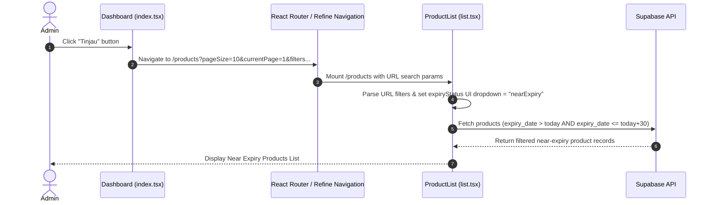

# Dashboard Near Expiry Review Button Navigation Specification

**Date:** 2026-08-10  
**Status:** Approved  
**Target Resource:** `products`  
**Components:** `src/pages/dashboard/index.tsx`, `src/pages/products/list.tsx`

---

## 1. Overview & Business Goal

When an administrator clicks the **"Tinjau" (Review)** button or the arrow navigation icon on the Dashboard's **Near Expiry Alert Card** (`src/pages/dashboard/index.tsx`), the application must navigate directly to the Products List page (`/products`) with pre-applied Refine `syncWithLocation` URL filters for near-expiry products (`gt today` and `lte today + 30 days`).

---

## 2. Requirements & User Flow

### 2.1 Dashboard Navigation (`src/pages/dashboard/index.tsx`)
- Compute `todayStr` (`YYYY-MM-DD`) and `thirtyDaysStr` (`YYYY-MM-DD`) dynamically using `dayjs`.
- Construct the Refine `syncWithLocation` URL:
  ```text
  /products?pageSize=10&currentPage=1&sorters[0][field]=created_at&sorters[0][order]=desc&filters[0][field]=expiry_date&filters[0][operator]=gt&filters[0][value]=<todayStr>&filters[1][field]=expiry_date&filters[1][operator]=lte&filters[1][value]=<thirtyDaysStr>
  ```
- Bind this navigation path to both:
  1. The "Tinjau" action button inside the Near Expiry alert card body.
  2. The circle arrow button in the Near Expiry card header.

### 2.2 Product List Integration (`src/pages/products/list.tsx`)
- Refine's `useTable` hook configured with `syncWithLocation: true` automatically decodes the `filters` and `sorters` from the URL search string.
- The `ProductList` component will inspect initial filters parsed by `useTable` / URL parameters on mount. If `expiry_date` filters (`gt` and `lte`) are present matching the near-expiry range, the UI select dropdown state (`expiryStatus`) will be initialized to `"nearExpiry"`, keeping the UI dropdown in sync with the table filter.

---

## 3. Architecture & Data Flow



---

## 4. Verification & Testing Strategy

1. **Dashboard Tests (`src/pages/__tests__/dashboard.test.tsx`)**:
   - Verify clicking "Tinjau" triggers navigation with the exact Refine `syncWithLocation` filter and sorter URL parameters.
2. **Product List Tests (`src/pages/__tests__/lists.test.tsx`)**:
   - Verify `ProductList` initializes the Expiry Status UI select dropdown to "nearExpiry" when mounted with URL filter parameters.
3. **Build & Type Check**:
   - Run `pnpm build` and `pnpm test` to ensure zero regressions.
